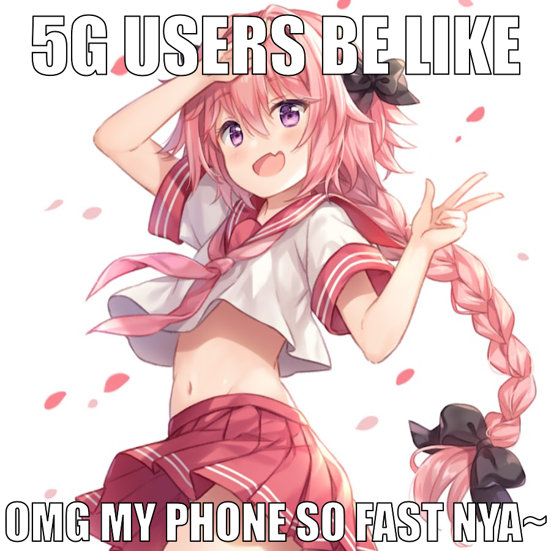

# memegen

A command-line meme generator written in Rust using ImageMagick

## Requirements

- ImageMagick installed
- DejaVu Sans Bold font installed. Check: `magick -list font | grep "DejaVu-Sans-Bold"`

## Installation

### Cargo

The installed binary will be available in ``~/.cargo/bin``

```sh
cargo install --git https://github.com/vendicated/memegen
```

## Usage

```
memegen <INPUT> <OUTPUT> [OPTIONS]

Arguments:
  <INPUT>   Path to local image file or URL
  <OUTPUT>  Path to save the generated meme

Options:
  --top-text <TEXT>     Top caption text
  --bottom-text <TEXT>  Bottom caption text
  -h, --help            Print help
```

## Example

```sh
$ memegen https://i.imgur.com/Yu6kZc5.jpg 5g.jpg --top-text "5g users be like" --bottom-text "omg my phone so fast nya~"
Done! Saved to 5g.jpg
```

Results in:

